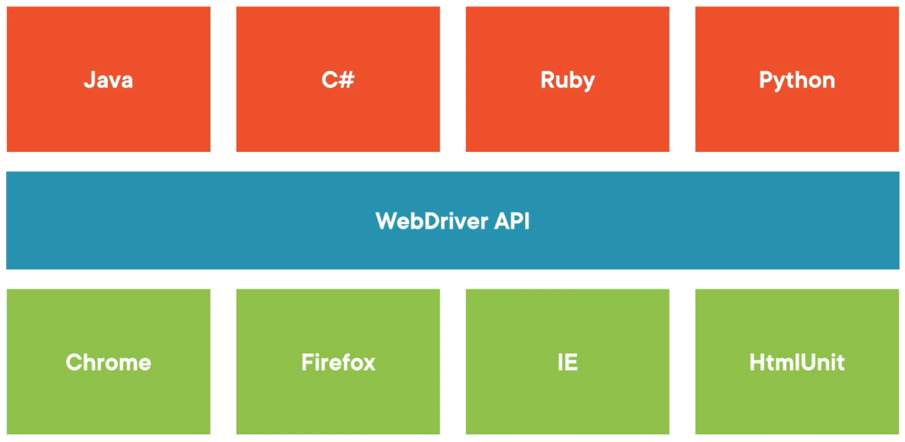
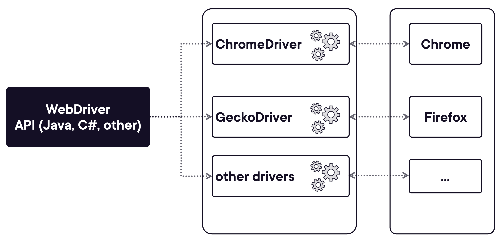
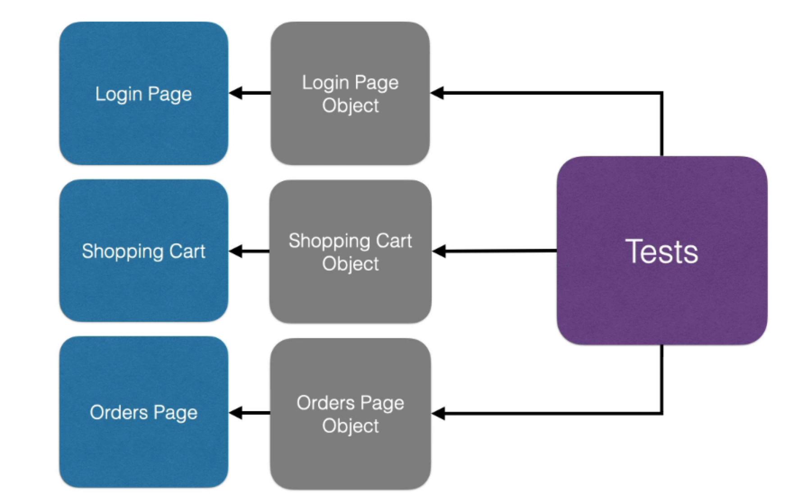

= Selenium Notes
:toc: right
:toclevels:5
:sectnums:

== Selenium WebDriver

=== WebDriver Installation

- Java 17
- Chrome Java Selenium  (Starting with 4.6, it should happend automatically)

----
brew install geckodriver

----

=== WebDriver Architecture

---

---

== References

- https://googlechromelabs.github.io/chrome-for-testing/#stable
- ✔️ /Users/nareshchaurasia/.cache/selenium/chromedriver
- https://www.selenium.dev/documentation/webdriver/
- https://www.browserstack.com/guide/architecture-of-selenium-webdriver
- https://www.selenium.dev/selenium/docs/api/java/org/openqa/selenium/WebDriver.html
- ✔️ https://www.javadoc.io/static/org.seleniumhq.selenium/selenium-api/4.8.0/index.html?org/openqa/selenium/WebDriver.html
- https://github.com/SeleniumHQ/selenium/wiki/

== ✔️ WebElement

In Selenium, every item you interact with on a webpage (like buttons, text boxes, links, etc.) is called a *WebElement*.

To automate any interaction with a webpage, you first need to *locate* the element, then *perform an action* on it.

*Common WebElement Methods*

[cols="1,2,2", options="header"]
|===
| Method
| Purpose
| Example

| `click()`
| Clicks the element (like a button)
| `loginButton.click();`

| `sendKeys("text")`
| Types text into a field
| `usernameField.sendKeys("john");`

| `getText()`
| Gets visible text of element
| `label.getText();`

| `clear()`
| Clears a text field
| `searchBox.clear();`

| `isDisplayed()`
| Checks if element is visible
| `element.isDisplayed();`

| `isEnabled()`
| Checks if element is enabled
| `submit.isEnabled();`

| `isSelected()`
| Checks if checkbox/radio is selected
| `checkbox.isSelected();`
|===

*How to Locate a WebElement*

Before using any WebElement method, you must first *locate* the element using:

* ✔️ `By.id`
* ✔️ `By.name`
* ✔️ `By.className`
* ✔️ `By.tagName`
* ✔️ `By.linkText`
* ✔️️ `By.partialLinkText`
* ✔️ `By.xpath`
* ✔️ `By.cssSelector`

*Example: Login Form*

Imagine a simple login form:

[source, html]
----
<input type="text" id="username" name="user">
<input type="password" id="password">
<button id="loginBtn">Login</button>
----

*Java Selenium Code:*

[source, java]
----
WebElement userField = driver.findElement(By.id("username"));
WebElement passField = driver.findElement(By.id("password"));
WebElement loginButton = driver.findElement(By.id("loginBtn"));

userField.sendKeys("testuser");
passField.sendKeys("password123");
loginButton.click();
----

################

== ✔️ CSS Selectors

CSS Selectors in Selenium are used to locate elements based on their styles, attributes, or hierarchical structure.

* Faster than XPath in most browsers.
* More readable and concise.
* Powerful combinations using tag, class, attribute, etc.

✔ *1. Select by ID*

*CSS Selector:* `#elementId`
[source,java]
----
WebElement usernameField = driver.findElement(By.cssSelector("#username"));
usernameField.sendKeys("admin");
----

✔ *2. Select by Class*

*CSS Selector:* `.className`
[source,java]
----
WebElement loginButton = driver.findElement(By.cssSelector(".login-button"));
loginButton.click();
----

✔ *3. Select by Tag and Attribute*

*CSS Selector:* `tagName[attribute='value']`
[source,java]
----
WebElement emailField = driver.findElement(By.cssSelector("input[type='email']"));
emailField.sendKeys("test@example.com");
----

*Practice Assignment*

Given the HTML:
[source,html]
----
<input id="username" class="input-field" type="text" name="user">
<input id="password" type="password" name="pass">
<button class="btn login-btn" type="submit">Login</button>
----

Write Selenium code to:

1. Select the username field.
+
[source,java]
----
WebElement userField = driver.findElement(By.cssSelector("#username"));
----

2. Select the button with class `login-btn`.
+
[source,java]
----
WebElement loginBtn = driver.findElement(By.cssSelector(".login-btn"));
----

3. Select input with name starting with `us`.
+
[source,java]
----
WebElement userInput = driver.findElement(By.cssSelector("input[name='user']"));
----

##############################################

== POM

Page Object Model (POM) is a design pattern in Selenium that creates an object repository for web elements. It helps improve code readability, reusability, and maintainability.

* Reduces code duplication
* Separates test logic from UI locators
* Makes maintenance easier if UI changes
* Enhances test scalability

---

---

